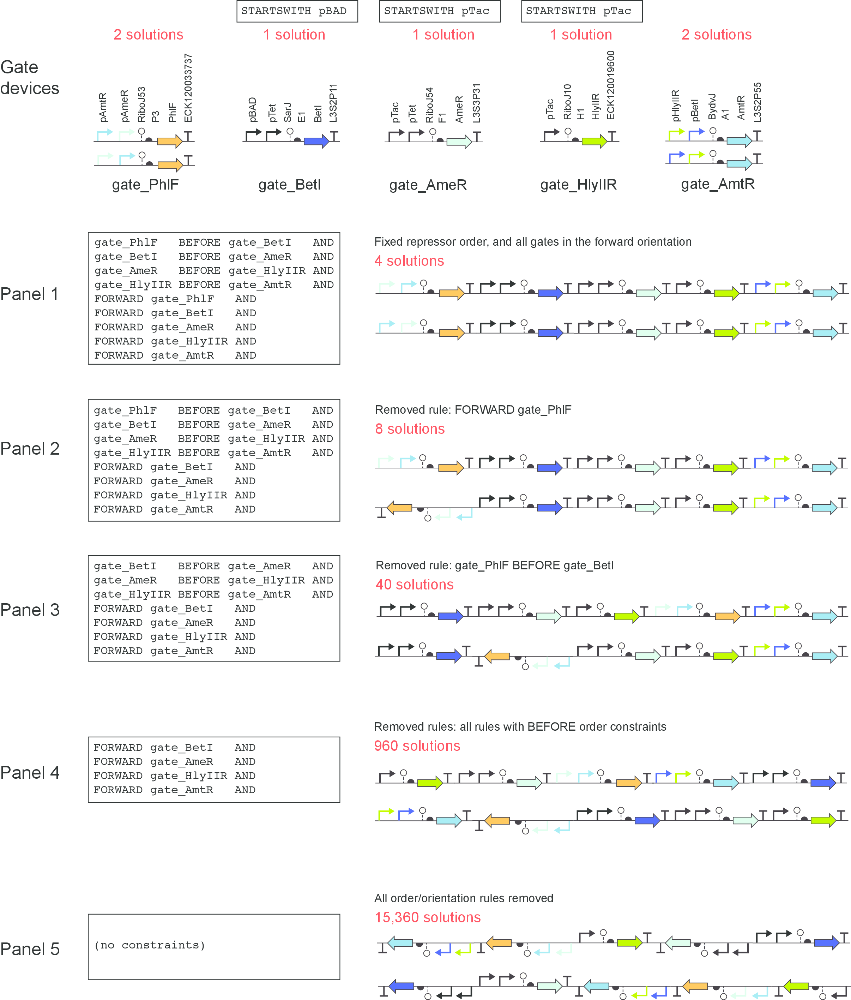

# Cello [](https://travis-ci.org/LivingComputingProject/cello.svg?branch=develop)

The Cello input is a high-level logic specification written in Verilog, a hardware description language.  The code is parsed to generate a truth table, and logic synthesis produces a circuit diagram with the genetically available gate types to implement the truth table.  The gates in the circuit are assigned using experimentally characterized genetic gates.  In assignment, a predicted circuit score guides a breadth-first search, or a Monte Carlo simulated annealing search.  The assignment with the highest score is chosen, and this assignment can be physically implemented in a combinatorial number of different genetic layouts.  The Eugene language is used for rule-based constrained combinatorial design of one or more final DNA sequence(s) for the designed circuit.

## Verilog specification.

Verilog programs start with a module keyword, followed by the module name, followed by the list of output and input wire names.  Within a module definition, Cello currently parses three forms of Verilog: case statements, assign statements, and structural elements (examples below).  Verilog code can be entered using a text editor and saved with a .v extension.

#### Case

Recommended for specifying a truth table.  The case statement below specifies the following truth table:

in1 | in2 | out1
--- | --- | ----
0   | 0   | 0
0   | 1   | 1
1   | 0   | 1
1   | 1   | 0

```
module XOR(output out1, input in1, in2);
  always@(in1,in2)
    begin
      case({in1,in2})
        2'b00: {out1} = 1'b0;
        2'b01: {out1} = 1'b1;
        2'b10: {out1} = 1'b1;
        2'b11: {out1} = 1'b0;
      endcase
    end
endmodule
```

#### Assign

Allowed operators: ~ (NOT), | (OR), & (AND), and parentheses can be used for order of operations.  These operators can be used to build any combinational logic function.  Internal wires must be defined before use, and wires must be assigned on the left-hand side before being used on the right-hand side.

```
module XOR(output out1,  input in1, in2);
  wire w1, w2;
  assign w1 = ~in1 & in2;
  assign w2 = in1 & ~in2;
  assign out1 = w1 | w2;
endmodule
```

#### Structural

Allows a gate-level wiring diagram to be specified.  Internal wires must be defined before use.  Each row must start with the all-lowercase name of a logic gate (not, nor, or, and, nand, xor, xnor, buff).  Within the parenthesis, the first wire name is the output wire, all subsequent wire names are the input wires for that gate.  Wire names must appear as an output wire before being used as an input wire.

```
module XOR(output out1,  input in1, in2);
  wire w1, w2, w3, w4;
  not (w1, in1);
  not (w2, in2);
  not (w3, in1, w2);
  not (w4, in2, w1);
  or (out1, w3, w4);
endmodule
```


## Logic synthesis.

Verilog is parsed and converted to a truth table, which is the starting point of logic synthesis.  Our logic synthesis workflow is described below.


#### AND-Inverter Graph

The first step uses ABC (Mischenko and Brayton, Berkeley) to convert a truth table to an AND-Inverter Graph, which consists of 2-input AND gates and NOT gates.

#### NOR-Inverter Graph

The AND-Inverter Graph is converted to a NOR-Inverter Graph using DeMorgan's rule: A and B  equals  (not A) (nor) (not B).

#### Subcircuit substitutions

By specifying a library of subcircuit motifs, subcircuits from the NOR-Inverter Graph can be substituted for smaller but functionally equivalent logic motifs to reduce the number of gates in the circuit.  This step can also allow other gate types to be incorporated, such as AND, NAND, OR.  An gate type called OUTPUT_OR can also be specified: this motif typically represents tandem promoters driving expression of the output gene, such as a fluorescence reporter or other actuator.


## Gate assignment.

#### Gate library


While Cello can accommodate custom gates libraries through the UCF, the original work was based on TetR homologs acting as NOR/NOT gates.  The genetic parts for each gate are shown.


For the genetic gates shown above, each has an experimentally determined response function that relates one or more input values to an output value in standardized units (RPU = relative promoter units).  These response functions are fitted to a Hill equation with 4 parameters: ymax, ymin, K, n.

#### Response function matching


Assigning genetic gates to Boolean gates requires the output levels of each gate to map to valid input levels for the next gate in the circuit.  Some gate connections result in signal mismatches and poor predicted circuit performance.  The assignment step identifies the optimal way to select and connect genetic gates to generate the maximum overall dynamic range for the circuit.


#### Assignment algorithms

###### Breadth-first search

The breadth-first search guarantees the assignment with the global maximum score (tractable for circuits of ~10 or fewer gates and library sizes of ~20 or fewer gates).  Starting from the gates closest to the inputs, this algorithm exhaustively assigns one gate at a time, where signal mismatches are rejected.  For each accepted assignment, the next gate is assigned exhaustively, where signal mismatches are rejected.  Once all gates have been visited, the assignment with the highest circuit score is chosen.

###### Hill climbing

Hill climbing starts with a random assignment, then swaps the assignment of two gates.  Gate 1 is randomly selected from the circuit, and Gate 2 is randomly selected from the circuit or the unused gates in the library.  The swap is accepted if the circuit score increased.  Thousands of swaps are performed in a single trajectory, and hundreds of independent trajectories are run.  The assignment with the highest circuit score is chosen as the final assignment.

###### Simulated annealing

Simulated annealing is the same as hill climbing, but swaps that decrease circuit score are accepted with a probability that cools/anneals over time.  While each trajectory requires more time than a hill climbing trajectory, local minima can be escaped.


## Plasmid design.

For a given assignment, there are a combinatorial number of ways in which the genetic parts can be assembled into a physical layout.  The degrees of freedom include: the order of tandem promoters, and the order/orientation of transcriptional units.  The Eugene language is used for constrained enumeration of this design space.  An example of a Eugene specification is given below.


#### Eugene

<a href="https://cidar.bu.edu/EugeneLab/eugenelab.html">visit Eugene Lab</a>

The example Eugene code (link below) can be copied/pasted and modified at Eugene Lab (link above).  Cello generates the Eugene files automatically and is integrated with the Eugene java library.

[example Eugene file for a genetic circuit](resources/eugene/majority_1_default.eug)




#### Genetic locations

The final DNA sequences that result from Eugene variants are then inserted into the plasmid or genomic locations specified in the UCF.  This specification is a Genbank file and start/end insertion base-pair indexes where the sensor module (e.g. expression of LacI, AraC), circuit module (e.g. TetR homolog logic gates), and output module (e.g. fluorescence reporter driven by a regulable promoter). As a result, the complete DNA sequence required to implement the logic circuit in cells is generated.


Install and Run Cello
----------------------------
Instructions to install Cello can be found in [INSTALL.md](INSTALL.md). Instructions to run a local instance of Cello can be found in [RUN.md](RUN.md).


Contributing to this project
----------------------------

Anyone and everyone is welcome to contribute. Please take a moment to
review the [guidelines for contributing](CONTRIBUTING.md).

* [Bug reports](CONTRIBUTING.md#bugs)
* [Feature requests](CONTRIBUTING.md#features)
* [Pull requests](CONTRIBUTING.md#pull-requests)

Contact Us
----------------------------
If you would like to receive updates from the Cello team regarding bug fixes, patches, feature updates or if you would like to contact the Cello team, please check the links in [CONTACT.md](CONTACT.md)
