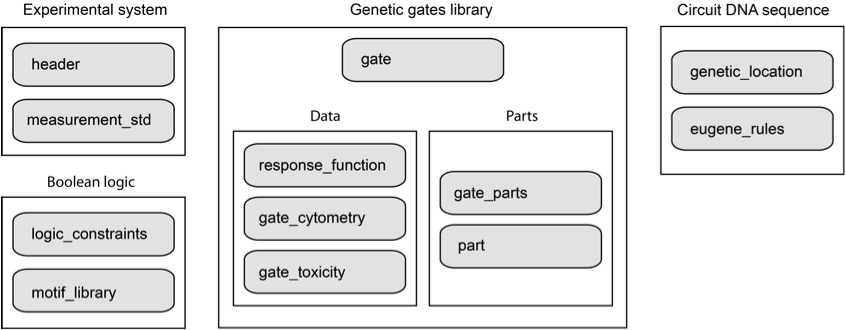

## Guide to writing a new User Constraint File (UCF)

The UCF specifies the genetic gates library that is the basis of circuit design in Cello.  In addition to the genetic gates library, the UCF can also specify a Boolean logic motif library, Eugene rules, and genetic "landing pads" for the sensor, circuit, and output modules.

## Overview

The UCF is specified using JavaScript Object Notation (JSON).  JSON is now a widely used and language-independent format based on attribute:value pairs, which is human readable, machine parseable, and can be converted to common data structures in other language. In a JSON attribute:value pair, the values are restricted to these types: string, number, boolean, null, array (square brackets), and object (curly brackets).

## Required collections:	

#### header: [view Eco1C1G1T1 example](resources/UCF/Eco1C1G1T1/Eco1C1G1T1.header.json)

attribute | type | description
------|------|------------
version | string | description
date | string | description
author | array of strings | description
organism | string | description
genome | string | description
media | string | description
growth | string | description

#### measurement_std: [view Eco1C1G1T1 example](resources/UCF/Eco1C1G1T1/Eco1C1G1T1.measurement_std.json)

attribute | type | description
------|------|------------
signal_carrier_units | string | description
normalization_instructions | string | description
plasmid_description | string | description
plasmid_sequence | array of strings | description

#### logic_constraints: [view Eco1C1G1T1 example](resources/UCF/Eco1C1G1T1/Eco1C1G1T1.logic_constraints.json)

attribute | type | description
------|------|------------
available_gates | array of objects | description

###### object in "available_gates" array:

attribute | type | description
------|------|------------
type | string | description
max_instances | integer | description

#### gates: [view Eco1C1G1T1 example](resources/UCF/Eco1C1G1T1/Eco1C1G1T1.gates.json)

attribute | type | description
------|------|------------
gate_name | string | description
gate_type | string | description
group_name | string | description
regulator | string | description
system | string | description
color_hexcode | string | (OPTIONAL) description

#### response_function: [view Eco1C1G1T1 example](resources/UCF/Eco1C1G1T1/Eco1C1G1T1.response_functions.json)

attribute | type | description
------|------|------------
gate_name | string | description
equation | string | description
variables | array of objects | description
parameters | array of objects | description

###### object in "variables" array:

attribute | type | description
------|------|------------
name | string | description
off_threshold | float | description
on_threshold | float | description

###### object in "parameters" array:

attribute | type | description
------|------|------------
name | string | description
value | float | description

#### gate_parts: [view Eco1C1G1T1 example](resources/UCF/Eco1C1G1T1/Eco1C1G1T1.gate_parts.json)

attribute | type | description
------|------|------------
gate_name | string | description
expression_cassettes | array of objects | description
promoter | string | description

###### object in "expression_cassettes" array:

attribute | type | description
------|------|------------
maps_to_variable | string | description
cassette_parts | array of strings | description

#### parts: [view Eco1C1G1T1 example](resources/UCF/Eco1C1G1T1/Eco1C1G1T1.parts.json)

attribute | type | description
------|------|------------
type | string | description
name | string | description
dnasequence | string | description

## Optional collections:

#### motif_library: [view Eco1C1G1T1 example](resources/UCF/Eco1C1G1T1/Eco1C1G1T1.motif_library.json)

if omitted, subgraph substitution will not occur as an optimization step in logic synthesis.

attribute | type | description
------|------|------------
inputs | array of strings | description
outputs | array of strings | description
netlist | array of strings | description

#### gate_cytometry: [view Eco1C1G1T1 example](resources/UCF/Eco1C1G1T1/Eco1C1G1T1.gate_cytometry.json)

if omitted, the output predictions will be median values, as opposed to cytometry distributions. 

attribute | type | description
------|------|------------
gate_name | string | description
cytometry_data | array of objects | description

###### object in "cytometry_data" array:

attribute | type | description
------|------|------------
input | float | description
output_bins | array of floats | description
output_counts | array of floats | description

#### gate_toxicity: [view Eco1C1G1T1 example](resources/UCF/Eco1C1G1T1/Eco1C1G1T1.gate_toxicity.json)

if omitted, the prediction of growth impact will not be calculated.

attribute | type | description
------|------|------------
gate_name | string | description
input | array of floats | description
growth | array of floats | description

#### eugene_rules: [view Eco1C1G1T1 example](resources/UCF/Eco1C1G1T1/Eco1C1G1T1.eugene_rules.json)

if omitted, unconstrained circuit layout design will occur.  This will result in variations in tandem promoter order, variations in gate order, and variations in gate orientation.

attribute | type | description
------|------|------------
eugene_part_rules | array of strings | description
eugene_gate_rules | array of strings | description

Eugene keywords:

category | list of rule keywords
------|------|------------
counting | CONTAINS, NOTCONTAINS, EXACTLY, NOTEXACTLY, MORETHAN, NOTMORETHAN, SAME_COUNT, WITH, NOTWITH, THEN
positioning | STARTSWITH, ENDSWITH, AFTER, ALL_AFTER, SOME_AFTER, BEFORE, ALL_BEFORE, SOME_BEFORE, NEXTTO, ALL_NEXTTO, SOME_NEXTTO
pairing | EQUALS, NOTEQUALS
orientation | ALL_FORWARD, ALL_REVERSE, FORWARD, ALL_FORWARD, REVERSE, ALL_REVERSE, SAME_ORIENTATION, ALL_SAME_ORIENTATION, ALTERNATE_ORIENTATION
interaction | REPRESSES, INDUCES, DRIVES
logic | NOT, AND, OR

#### genetic_locations: [view Eco1C1G1T1 example](resources/UCF/Eco1C1G1T1/Eco1C1G1T1.genetic_locations.json)

if omitted, the output DNA sequence will contain the circuit components only, and the user will be responsible for deciding and implementing the genetic context of the circuit design.

attribute | type | description
------|------|------------
locations | array of objects | description
sensor_module_location | array of objects | description
circuit_module_location | array of objects | description
output_module_location | array of objects | description

###### object in "locations" array:

attribute | type | description
------|------|------------
name | string | description
file | array of strings | description

###### object in module location arrays:

attribute | type | description
------|------|------------
location_name | string | description
bp_range | array of integers | description
unit_conversion | float | ("output_module_location" only), 

